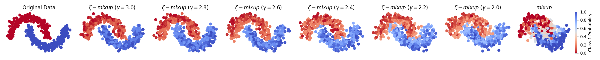
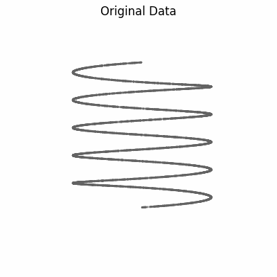
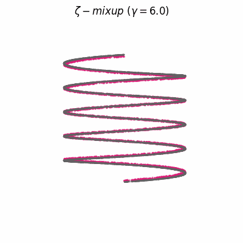
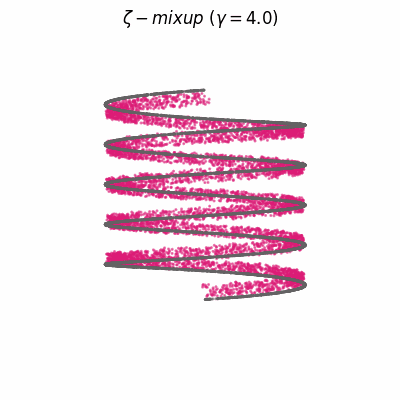
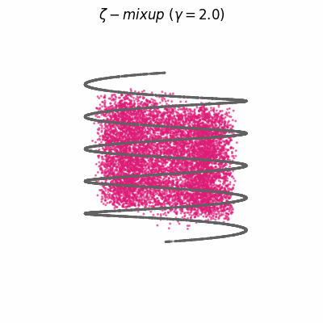
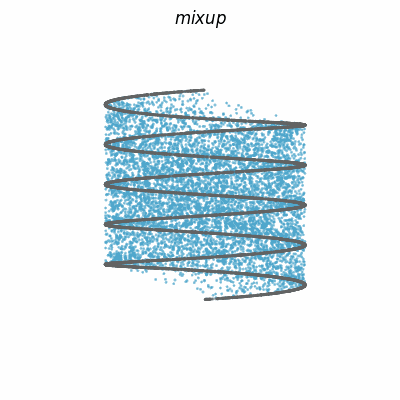

# _ζ_-mixup

This repository hosts the code supporting our two papers on **_ζ_-mixup**.

_ζ_-mixup is a **multi-sample mixing-based data augmentation** method to generate richer and more realistic outputs. _ζ_-mixup is a **generalization of mixup** with provably and demonstrably desirable properties that allows for **convex combinations of _N_ ≥ 2 samples** weighted using a _p_-series interpolant. _ζ_-mixup better preserves the **intrinsic dimensionality** of the original datasets, is **computationally efficient**, and **outperforms** mixup, CutMix, and traditional data augmentation methods. Here are some visualizations comparing _ζ_-mixup to mixup:

#### Half-moons dataset (_N_ = 512)
512 samples with non-linear class boundaries distributed in the shape of interleaving crescents.



#### 1-D helix embedded in $\mathbb{R}^3$ (_N_ = 8192) 
8192 samples on a 1D helix as an example of low-D manifolds lying in high-D ambient spaces.

<!-- https://felixhayashi.github.io/ReadmeGalleryCreatorForGitHub/ -->
</img>
</img>
</img>
</img>
</img>

## Repository Structure

- [`zeta_mixup.py`](zeta_mixup.py): Code for _ζ_-mixup data augmentation.
- [`utils.py`](utils.py): Utility functions: codes for generating the weights for _ζ_-mixup and cross-entropy loss with "soft" target labels.
- [`mixup.py`](mixup.py): Original mixup implementation ([source](https://github.com/hongyi-zhang/mixup/blob/master/cifar/utils.py#L17)). Used only for the visualizations above.
- [`demo/`](demo/): 
    - [`demo_2d_halfmoons.py`](demo/demo_2d_halfmoons.py): Code for generating the half-moons visualizations shown above.
    - [`demo_3d_spirals.py`](demo/demo_3d_spirals.py): Code for generating the 1-D helix visualizations shown above.
    - [`demo_utils.py`](demo/demo_utils.py): Utility function for generating the half-moons dataset.
    - [`demo_visualizations/`](demo/demo_visualizations/): Output directory for visualizations shown above.

## Abstract

Modern deep learning training procedures rely on model regularization techniques such as data augmentation methods, which generate training samples that increase the diversity of data and richness of label information. A popular recent method, mixup, uses convex combinations of pairs of original samples to generate new samples. However, as we show in our experiments, mixup can produce undesirable synthetic samples, where the data is sampled off the manifold and can contain incorrect labels. We propose ζ-mixup, a generalization of mixup with provably and demonstrably desirable properties that allows convex combinations of _T_ ≥ 2 samples, leading to more realistic and diverse outputs that incorporate information from _T_ original samples by using a _p_-series interpolant. We show that, compared to mixup, ζ-mixup better preserves the intrinsic dimensionality of the original datasets, which is a desirable property for training generalizable models. Furthermore, we show that our implementation of ζ-mixup is faster than mixup, and extensive evaluation on controlled synthetic and 26 diverse real-world natural and medical image classification datasets shows that ζ-mixup outperforms mixup, CutMix, and traditional data augmentation techniques.


## Citation

If you use our code, please cite our papers: 

- Kumar Abhishek, Colin J. Brown, Ghassan Hamarneh, "[Multi-Sample _ζ_-mixup: Richer, More Realistic Synthetic Samples from a _p_-Series Interpolant](https://journalofbigdata.springeropen.com/articles/10.1186/s40537-024-00898-6)", Journal of Big Data (_J Big Data_), 2024.
- Kumar Abhishek, Colin J. Brown, Ghassan Hamarneh, "[_ζ_-mixup: Richer, More Realistic Mixing of Multiple Images]()", Medical Imaging with Deep Learning (MIDL), 2023.

The corresponding BibTeX entries are:

```
@article{abhishek2024multi,
author = {Abhishek, Kumar and Brown, Colin J. and Hamarneh, Ghassan},
title = {Multi-Sample $\zeta$-mixup: Richer, More Realistic Synthetic Samples from a $p$-Series Interpolant},
journal = {Journal of Big Data},
volume = {11},
number = {1},
pages = {1--41},
month = {Mar},
year = {2024},
ISSN = {2196-1115},
url = {http://dx.doi.org/10.1186/s40537-024-00898-6},
DOI = {10.1186/s40537-024-00898-6},
publisher = {Springer}
}

@inproceedings{abhishek2023zetamixup,
title = {$\zeta$-mixup: Richer, More Realistic Mixing of Multiple Images},
author = {Kumar Abhishek and Colin Joseph Brown and Ghassan Hamarneh},
booktitle = {Medical Imaging with Deep Learning, short paper track},
year = {2023},
pages = {1--5},
url = {https://openreview.net/forum?id=iXjsAarmqn}
}
```

