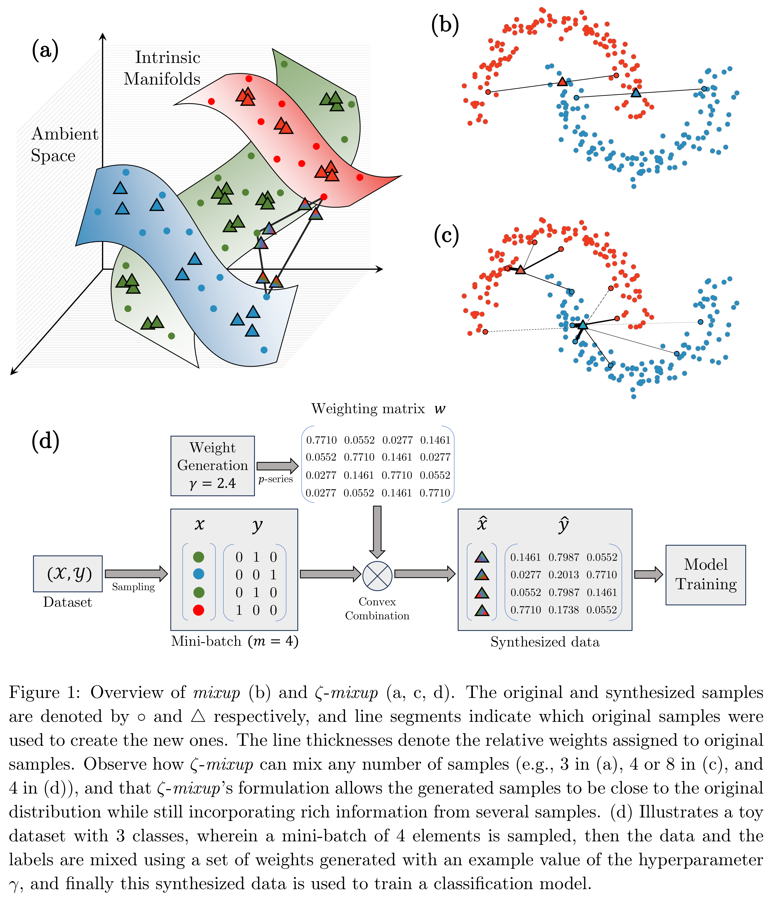

# _ζ_-mixup

This repository will host the code supporting our work ["**Multi-Sample _ζ_-mixup: Richer, More Realistic Synthetic Samples from a _p_-Series Interpolant**"](https://www.cs.sfu.ca/~hamarneh/ecopy/jbd2024.pdf), accepted at the Journal of Big Data.

If you use our code, please cite our paper: 

Kumar Abhishek, Colin J. Brown, Ghassan Hamarneh, "[Multi-Sample _ζ_-mixup: Richer, More Realistic Synthetic Samples from a _p_-Series Interpolant]([https://openaccess.thecvf.com/content_CVPRW_2020/html/w42/Abhishek_Illumination-Based_Transformations_Improve_Skin_Lesion_Segmentation_in_Dermoscopic_Images_CVPRW_2020_paper.html](https://www.cs.sfu.ca/~hamarneh/ecopy/jbd2024.pdf))", Journal of Big Data, 2024.

The corresponding bibtex entry is:

```
@article{Abhishek_2024_JBD,
author = {Abhishek, Kumar and Brown, Colin J. and Hamarneh, Ghassan},
title = {Multi-Sample ζ-mixup: Richer, More Realistic Synthetic Samples from a _p_-Series Interpolant},
journal = {Journal of Big Data},
year = {2024}
}
```

## Abstract

Modern deep learning training procedures rely on model regularization techniques such as data augmentation methods, which generate training samples that increase the diversity of data and richness of label information. A popular recent method, mixup, uses convex combinations of pairs of original samples to generate new samples. However, as we show in our experiments, mixup can produce undesirable synthetic samples, where the data is sampled off the manifold and can contain incorrect labels. We propose ζ-mixup, a generalization of mixup with provably and demonstrably desirable properties that allows convex combinations of _T_ ≥ 2 samples, leading to more realistic and diverse outputs that incorporate information from _T_ original samples by using a _p_-series interpolant. We show that, compared to mixup, ζ-mixup better preserves the intrinsic dimensionality of the original datasets, which is a desirable property for training generalizable models. Furthermore, we show that our implementation of ζ-mixup is faster than mixup, and extensive evaluation on controlled synthetic and 26 diverse real-world natural and medical image classification datasets shows that ζ-mixup outperforms mixup, CutMix, and traditional data augmentation techniques.


